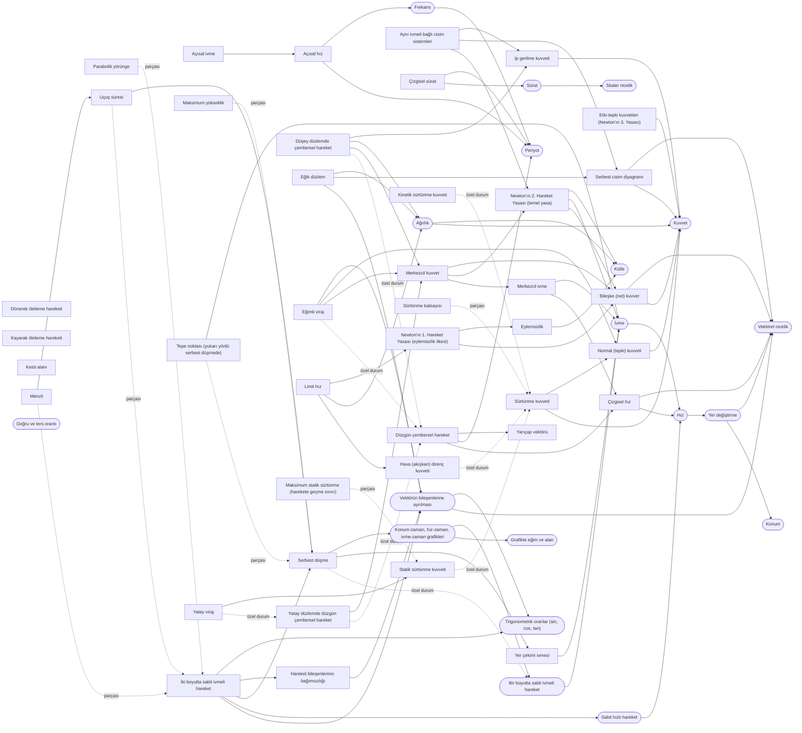
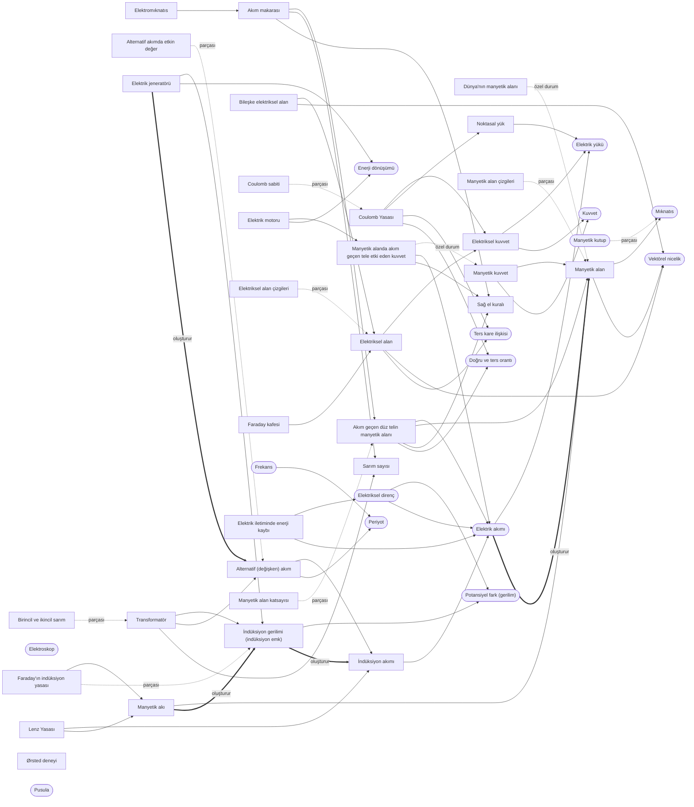
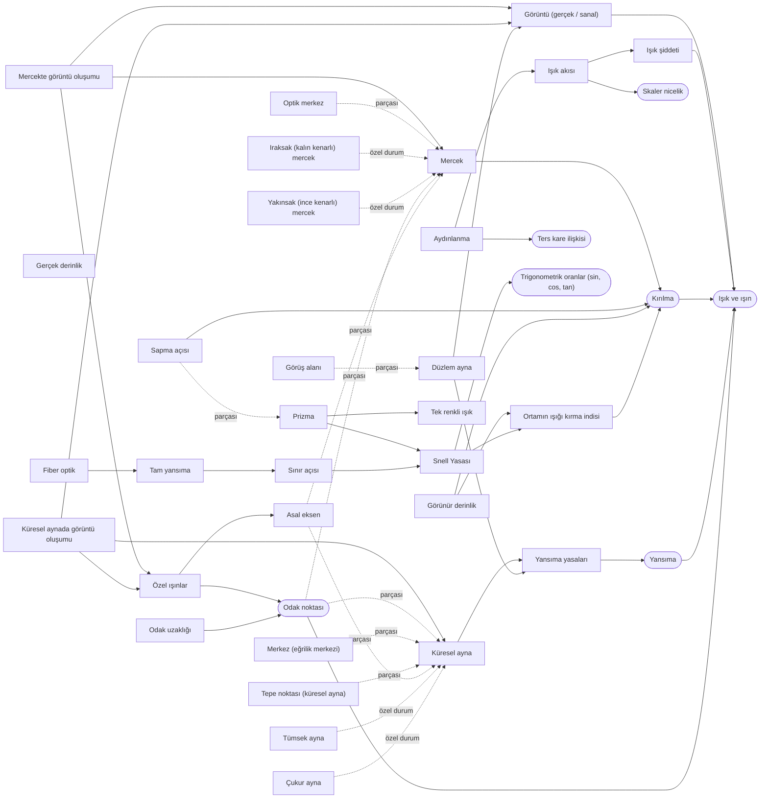

# 11. Sınıf Fizik — Kavram Grafiği

> Otomatik üretildi: `scripts/build_concepts.py` (kaynak veri: `scripts/data_concepts.py`). Elle düzenleme yapma.

- **Kavram:** 137 (104 11. sınıf, 33 ön koşul)
- **İlişki:** 220
- Kavram tanımları ve ilişkiler yapay zekâ tarafından yazıldı, **uzman incelemesi bekliyor** (güven: MEDIUM). Resmî anahtar kavramlar HIGH.

Okuma: `A --> B` = A, B'yi gerektirir (REQUIRES). Kesikli ok: özel durum / parçası.

## Ünite 1: KUVVET VE HAREKET

Yuvarlak kutu = önceki sınıflardan gelen ön koşul kavramı.

| Öğrenme çıktısı | 11. sınıf kavramları | Ön koşul kavramları |
|---|---|---|
| FİZ.11.1.1 | Serbest düşme, Yer çekimi ivmesi | Hız, İvme, Bir boyutta sabit ivmeli hareket, Kütle |
| FİZ.11.1.2 | Serbest düşme, Yer çekimi ivmesi, Tepe noktası (yukarı yönlü serbest düşmede), Maksimum yükseklik | Grafikte eğim ve alan, Konum, Yer değiştirme, Hız, İvme, Bir boyutta sabit ivmeli hareket, Konum-zaman, hız-zaman, ivme-zaman grafikleri |
| FİZ.11.1.3 | Yer çekimi ivmesi, Tepe noktası (yukarı yönlü serbest düşmede), Maksimum yükseklik, İki boyutta sabit ivmeli hareket, Hareket bileşenlerinin bağımsızlığı, Parabolik yörünge, Menzil, Uçuş süresi | Vektörel nicelik, Vektörün bileşenlerine ayrılması, Trigonometrik oranlar (sin, cos, tan), Grafikte eğim ve alan, Yer değiştirme, Hız, İvme, Sabit hızlı hareket, Bir boyutta sabit ivmeli hareket, Konum-zaman, hız-zaman, ivme-zaman grafikleri |
| FİZ.11.1.4 | Bileşke (net) kuvvet, Eylemsizlik, Newton'ın 1. Hareket Yasası (eylemsizlik ilkesi), Newton'ın 2. Hareket Yasası (temel yasa), Etki-tepki kuvvetleri (Newton'ın 3. Yasası) | İvme, Kuvvet, Kütle |
| FİZ.11.1.5 | Bileşke (net) kuvvet, Newton'ın 1. Hareket Yasası (eylemsizlik ilkesi), Newton'ın 2. Hareket Yasası (temel yasa), Etki-tepki kuvvetleri (Newton'ın 3. Yasası), Serbest cisim diyagramı, Normal (tepki) kuvveti, İp gerilme kuvveti, Aynı ivmeli bağlı cisim sistemleri, Eğik düzlem | Bir boyutta sabit ivmeli hareket, Kuvvet, Ağırlık |
| FİZ.11.1.6 | Sürtünme kuvveti, Statik sürtünme kuvveti, Kinetik sürtünme kuvveti, Maksimum statik sürtünme (harekete geçme sınırı), Kayarak öteleme hareketi, Dönerek öteleme hareketi |  |
| FİZ.11.1.7 | Newton'ın 2. Hareket Yasası (temel yasa), Normal (tepki) kuvveti, Eğik düzlem, Sürtünme kuvveti, Statik sürtünme kuvveti, Kinetik sürtünme kuvveti, Maksimum statik sürtünme (harekete geçme sınırı), Sürtünme katsayısı, Kayarak öteleme hareketi, Dönerek öteleme hareketi | Doğru ve ters orantı, Grafikte eğim ve alan |
| FİZ.11.1.8 | Hava (akışkan) direnç kuvveti, Newton'ın 1. Hareket Yasası (eylemsizlik ilkesi), Sürtünme kuvveti, Limit hız, Kesit alanı | Kütle, Ağırlık |
| FİZ.11.1.9 | Düzgün çembersel hareket, Yarıçap vektörü, Çizgisel hız | Vektörel nicelik |
| FİZ.11.1.10 | Bileşke (net) kuvvet, Newton'ın 2. Hareket Yasası (temel yasa), İp gerilme kuvveti, Statik sürtünme kuvveti, Düzgün çembersel hareket, Çizgisel hız, Çizgisel sürat, Açısal hız, Açısal ivme, Merkezcil ivme, Merkezcil kuvvet, Yatay düzlemde düzgün çembersel hareket, Düşey düzlemde çembersel hareket, Yatay viraj, Eğimli viraj | Skaler nicelik, Doğru ve ters orantı, Sürat, Ağırlık, Periyot, Frekans |

## Ünite 2: ELEKTRİK VE MANYETİZMA

Yuvarlak kutu = önceki sınıflardan gelen ön koşul kavramı.

| Öğrenme çıktısı | 11. sınıf kavramları | Ön koşul kavramları |
|---|---|---|
| FİZ.11.2.1 | Elektriksel kuvvet, Coulomb Yasası, Coulomb sabiti, Noktasal yük | Doğru ve ters orantı, Ters kare ilişkisi, Kuvvet, Elektrik yükü, Elektroskop |
| FİZ.11.2.2 | Noktasal yük, Elektriksel alan, Elektriksel alan çizgileri, Bileşke elektriksel alan | Vektörel nicelik, Ters kare ilişkisi, Elektrik yükü, Elektroskop |
| FİZ.11.2.3 | Elektriksel alan, Faraday kafesi |  |
| FİZ.11.2.4 | Manyetik alan, Manyetik alan çizgileri, Dünya'nın manyetik alanı | Mıknatıs, Manyetik kutup, Pusula |
| FİZ.11.2.5 | Manyetik alan, Ørsted deneyi, Akım geçen düz telin manyetik alanı, Sağ el kuralı, Manyetik alan katsayısı | Doğru ve ters orantı, Elektrik akımı, Pusula |
| FİZ.11.2.6 | Manyetik alan, Sağ el kuralı, Manyetik alan katsayısı, Akım makarası, Sarım sayısı | Elektrik akımı |
| FİZ.11.2.7 | Akım makarası, Elektromıknatıs |  |
| FİZ.11.2.8 | Manyetik alan, Sağ el kuralı, Manyetik kuvvet, Manyetik alanda akım geçen tele etki eden kuvvet | Vektörel nicelik, Doğru ve ters orantı, Kuvvet, Elektrik akımı |
| FİZ.11.2.9 | Manyetik kuvvet, Elektrik motoru | Enerji dönüşümü |
| FİZ.11.2.10 | Manyetik alan, Manyetik akı |  |
| FİZ.11.2.11 | Sarım sayısı, Manyetik akı, İndüksiyon gerilimi (indüksiyon emk), İndüksiyon akımı, Faraday'ın indüksiyon yasası, Lenz Yasası, Elektrik jeneratörü | Enerji dönüşümü, Potansiyel fark (gerilim) |
| FİZ.11.2.12 | İndüksiyon gerilimi (indüksiyon emk), İndüksiyon akımı, Elektrik jeneratörü, Alternatif (değişken) akım, Alternatif akımda etkin değer | Periyot, Frekans |
| FİZ.11.2.13 | Sarım sayısı, Transformatör, Birincil ve ikincil sarım, Elektrik iletiminde enerji kaybı | Potansiyel fark (gerilim), Elektriksel direnç |

## Ünite 3: OPTİK

Yuvarlak kutu = önceki sınıflardan gelen ön koşul kavramı.

| Öğrenme çıktısı | 11. sınıf kavramları | Ön koşul kavramları |
|---|---|---|
| FİZ.11.3.1 | Işık şiddeti, Işık akısı, Aydınlanma | Skaler nicelik, Ters kare ilişkisi, Işık ve ışın |
| FİZ.11.3.2 | Yansıma yasaları, Düzlem ayna, Görüntü (gerçek / sanal), Görüş alanı | Yansıma |
| FİZ.11.3.3 | Yansıma yasaları, Küresel ayna, Çukur ayna, Tümsek ayna, Asal eksen, Tepe noktası (küresel ayna), Merkez (eğrilik merkezi), Odak uzaklığı, Özel ışınlar | Işık ve ışın, Yansıma, Odak noktası |
| FİZ.11.3.4 | Görüntü (gerçek / sanal), Küresel ayna, Çukur ayna, Tümsek ayna, Özel ışınlar, Küresel aynada görüntü oluşumu |  |
| FİZ.11.3.5 | Ortamın ışığı kırma indisi, Snell Yasası, Sınır açısı, Tam yansıma, Sapma açısı | Trigonometrik oranlar (sin, cos, tan), Kırılma |
| FİZ.11.3.6 | Ortamın ışığı kırma indisi, Görünür derinlik, Gerçek derinlik | Kırılma |
| FİZ.11.3.7 | Sınır açısı, Tam yansıma, Fiber optik |  |
| FİZ.11.3.8 | Ortamın ışığı kırma indisi, Snell Yasası, Tam yansıma, Prizma, Tek renkli ışık, Sapma açısı | Kırılma |
| FİZ.11.3.9 | Asal eksen, Odak uzaklığı, Özel ışınlar, Mercek, Yakınsak (ince kenarlı) mercek, Iraksak (kalın kenarlı) mercek, Optik merkez | Işık ve ışın, Kırılma, Odak noktası |
| FİZ.11.3.10 | Görüntü (gerçek / sanal), Özel ışınlar, Mercek, Yakınsak (ince kenarlı) mercek, Iraksak (kalın kenarlı) mercek, Mercekte görüntü oluşumu |  |
