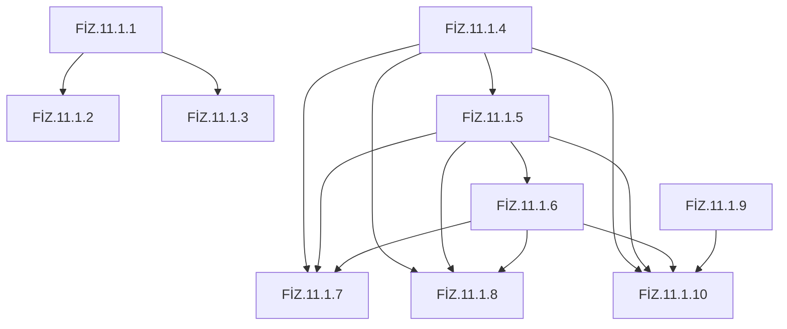
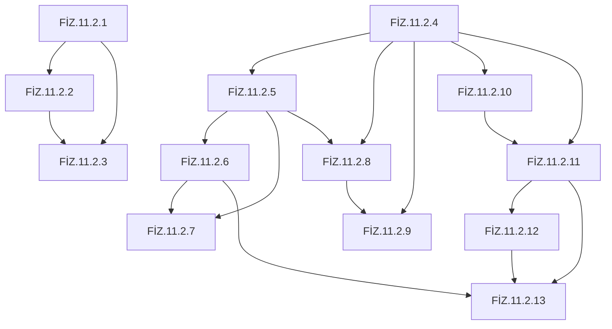
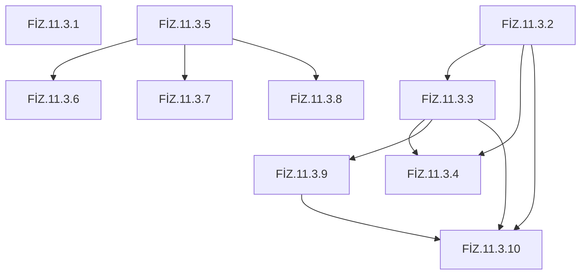

# 11. Sınıf Fizik — Ön Koşul Grafiği

> Otomatik üretildi: `scripts/build_prerequisites.py`. Elle düzenleme yapma.

Üç katman: (1) 11. sınıf içi çıktı bağımlılıkları — kavram grafiğinden türetilir; (2) 9–10. sınıf resmî çıktıları — her eşleme resmî metinde doğrulanır; (3) ortaokul ve matematik — resmî temel kabullerden, kodsuz.

## Ünite 1

**Temel kabuller (resmî):** Öğrencilerin hız, ivme ve ağırlık kavramlarını bildikleri, ilgili hesaplamaları yapabildikleri, periyot ve frekans kavramlarını bildikleri kabul edilmektedir.

Ok yönü: önce öğrenilmesi gereken → sonra gelen.

| Çıktı | 11. sınıf ön koşul çıktıları | 9–10. sınıf ön koşulları | Ortaokul / matematik |
|---|---|---|---|
| FİZ.11.1.1 | — | FİZ.10.1.1, FİZ.10.1.2, FİZ.10.1.3, FİZ.9.2.6 | Kütle |
| FİZ.11.1.2 | FİZ.11.1.1 | FİZ.10.1.1, FİZ.10.1.2, FİZ.10.1.3, FİZ.9.2.6 | Grafikte eğim ve alan |
| FİZ.11.1.3 | FİZ.11.1.1 | FİZ.10.1.1, FİZ.10.1.2, FİZ.10.1.3, FİZ.9.2.2, FİZ.9.2.3, FİZ.9.2.4, FİZ.9.2.6 | Grafikte eğim ve alan, Trigonometrik oranlar (sin, cos, tan) |
| FİZ.11.1.4 | — | FİZ.10.1.2, FİZ.9.2.5 | Kütle |
| FİZ.11.1.5 | FİZ.11.1.4 | FİZ.10.1.2, FİZ.10.1.3, FİZ.9.2.5 | Ağırlık |
| FİZ.11.1.6 | FİZ.11.1.5 | — | — |
| FİZ.11.1.7 | FİZ.11.1.4, FİZ.11.1.5, FİZ.11.1.6 | — | Doğru ve ters orantı, Grafikte eğim ve alan |
| FİZ.11.1.8 | FİZ.11.1.4, FİZ.11.1.5, FİZ.11.1.6 | — | Ağırlık, Kütle |
| FİZ.11.1.9 | — | FİZ.9.2.2, FİZ.9.2.3 | — |
| FİZ.11.1.10 | FİZ.11.1.4, FİZ.11.1.5, FİZ.11.1.6, FİZ.11.1.9 | FİZ.10.4.1, FİZ.10.4.2, FİZ.9.2.2, FİZ.9.2.6 | Ağırlık, Doğru ve ters orantı |

## Ünite 2

**Temel kabuller (resmî):** Öğrencilerin elektriklenme çeşitlerini ve yüklü cisimler ile elektroskop arasındaki etkileşimi, mıknatısların kutuplarını, mıknatısların etkileşimini ve pusula kullanımını bildiği kabul edilmektedir.

Ok yönü: önce öğrenilmesi gereken → sonra gelen.

| Çıktı | 11. sınıf ön koşul çıktıları | 9–10. sınıf ön koşulları | Ortaokul / matematik |
|---|---|---|---|
| FİZ.11.2.1 | — | FİZ.9.2.5 | Doğru ve ters orantı, Elektrik yükü, Elektroskop, Ters kare ilişkisi |
| FİZ.11.2.2 | FİZ.11.2.1 | FİZ.9.2.2, FİZ.9.2.3 | Elektrik yükü, Elektroskop, Ters kare ilişkisi |
| FİZ.11.2.3 | FİZ.11.2.1, FİZ.11.2.2 | — | — |
| FİZ.11.2.4 | — | — | Manyetik kutup, Mıknatıs, Pusula |
| FİZ.11.2.5 | FİZ.11.2.4 | FİZ.10.3.2 | Doğru ve ters orantı, Pusula |
| FİZ.11.2.6 | FİZ.11.2.5 | FİZ.10.3.2 | — |
| FİZ.11.2.7 | FİZ.11.2.5, FİZ.11.2.6 | — | — |
| FİZ.11.2.8 | FİZ.11.2.4, FİZ.11.2.5 | FİZ.10.3.2, FİZ.9.2.2, FİZ.9.2.3, FİZ.9.2.5 | Doğru ve ters orantı |
| FİZ.11.2.9 | FİZ.11.2.4, FİZ.11.2.8 | FİZ.10.2.3, FİZ.10.2.4 | — |
| FİZ.11.2.10 | FİZ.11.2.4 | — | — |
| FİZ.11.2.11 | FİZ.11.2.10, FİZ.11.2.4 | FİZ.10.2.3, FİZ.10.2.4, FİZ.10.3.1 | — |
| FİZ.11.2.12 | FİZ.11.2.11 | FİZ.10.4.1, FİZ.10.4.2 | — |
| FİZ.11.2.13 | FİZ.11.2.11, FİZ.11.2.12, FİZ.11.2.6 | FİZ.10.3.1, FİZ.10.3.3 | — |

## Ünite 3

**Temel kabuller (resmî):** Öğrencilerin fen bilimleri dersinde geçen ışın, ışık ve aydınlanma kavramlarını bildiği, düzlem ayna, küresel ayna ve mercekleri temel özelliklerine göre sınıflandırabildiği ve yansıma, kırılma ve odak noktası kavramlarını bildiği kabul edilmektedir.

Ok yönü: önce öğrenilmesi gereken → sonra gelen.

| Çıktı | 11. sınıf ön koşul çıktıları | 9–10. sınıf ön koşulları | Ortaokul / matematik |
|---|---|---|---|
| FİZ.11.3.1 | — | FİZ.9.2.2 | Işık ve ışın, Ters kare ilişkisi |
| FİZ.11.3.2 | — | — | Yansıma |
| FİZ.11.3.3 | FİZ.11.3.2 | — | Işık ve ışın, Odak noktası, Yansıma |
| FİZ.11.3.4 | FİZ.11.3.2, FİZ.11.3.3 | — | — |
| FİZ.11.3.5 | — | — | Kırılma, Trigonometrik oranlar (sin, cos, tan) |
| FİZ.11.3.6 | FİZ.11.3.5 | — | Kırılma |
| FİZ.11.3.7 | FİZ.11.3.5 | — | — |
| FİZ.11.3.8 | FİZ.11.3.5 | — | Kırılma |
| FİZ.11.3.9 | FİZ.11.3.3 | — | Işık ve ışın, Kırılma, Odak noktası |
| FİZ.11.3.10 | FİZ.11.3.2, FİZ.11.3.3, FİZ.11.3.9 | — | — |

## Kullanılan 9–10. sınıf çıktıları

| Kod | Resmî metin |
|---|---|
| FİZ.9.2.2 | Skaler ve vektörel nicelikleri karşılaştırabilme |
| FİZ.9.2.3 | Aynı doğrultu üzerinde yer alan farklı vektörlerin yön ve büyüklüklerine yönelik bilimsel çıkarım yapabilme |
| FİZ.9.2.4 | Vektörlerin toplanmasında kullanılan uç uca ekleme ve paralelkenar yöntemi ile bileşenlerine ayırma işlemine ilişkin tümevarımsal akıl yürütebilme |
| FİZ.9.2.5 | Doğadaki temel kuvvetleri karşılaştırabilme |
| FİZ.9.2.6 | Hareketin temel kavramlarının tanımlarına yönelik tümevarımsal akıl yürütebilme |
| FİZ.10.1.1 | Yatay doğrultuda sabit hızlı hareket ile ilgili tümevarımsal akıl yürütebilme |
| FİZ.10.1.2 | İvme ve hız değişimi arasındaki ilişkiye yönelik tümevarımsal akıl yürütebilme |
| FİZ.10.1.3 | Yatay doğrultuda sabit ivmeyle hareket eden cisimlerin hareket grafiklerinden elde edilen matematiksel modelleri yorumlayabilme |
| FİZ.10.2.3 | Enerji biçimlerini karşılaştırabilme |
| FİZ.10.2.4 | Mekanik enerjiyi çözümleyebilme |
| FİZ.10.3.1 | Basit elektrik devresinde potansiyel fark, elektrik akımı ve direnç kavramlarının tanımına ilişkin analojik akıl yürütebilme |
| FİZ.10.3.2 | Elektrik yükünün hareketi üzerinden elektrik akımı kavramını çözümleyebilme |
| FİZ.10.3.3 | Ohm Yasası ile ilgili tümevarımsal akıl yürütebilme |
| FİZ.10.4.1 | Periyodik hareketlere ilişkin deneyimlerini yansıtabilme |
| FİZ.10.4.2 | Dalgaların temel kavramlarına ilişkin operasyonel tanımlama yapabilme |
